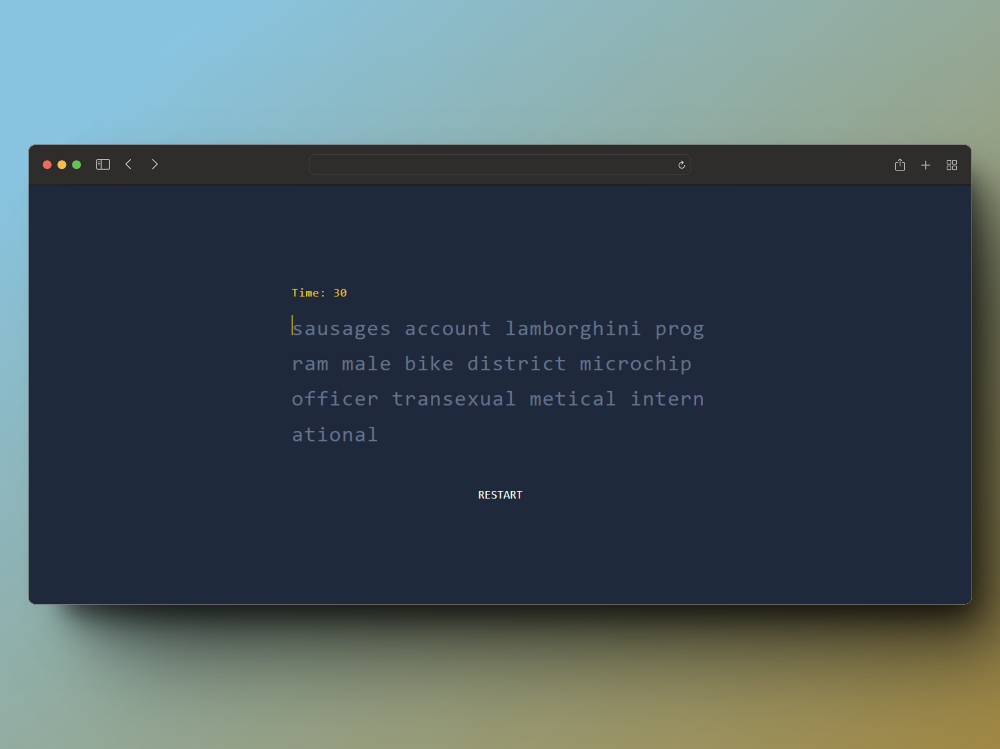

# MAFFI TYPE

This is a project that aims to make a typing engine without libraries and only using TypeScript and ReactJS.

-----

## TECHNOLOGIES USED

### - ReactJS
### - TypeScript
### - Tailwind

Use as little as possible to make it as fast as possible and with very low consumption in the server and in the browser.

## SAMPLE

All of this is subject to change and improvement.

## How to contribute?

Just fork, add or modify changes. Specify what you did and make a pull request